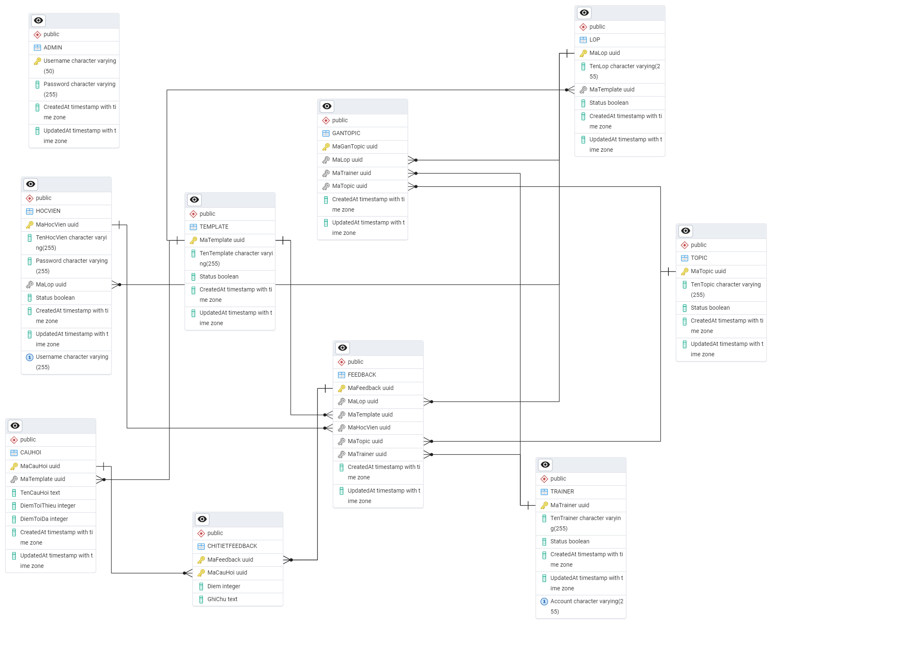

# Online Feedback Management & Analytics System
- Hệ thống quản lý và phân tích phản hồi trực tuyến toàn diện, được hiện đại hóa từ tài liệu đặc tả SRS v1.0  sang kiến trúc RESTful API sử dụng Spring Boot 3 và ReactJS.

### Mục đích dự án
Xây dựng hệ thống đánh giá chất lượng giảng viên và nội dung đào tạo tại các cơ sở giáo dục quy mô vừa và nhỏ.

- Giao diện Admin:

- Giao diện User:

###  Tech Stack
- Backend: Java 21, Spring Boot 3.x, Spring Security (JWT), Spring Data JPA, Hibernate, MapStruct, Lombok.
- Frontend: ReactJS, TailwindCSS, Recharts (Real-time Analytics Dashboard), Lucide React.
- Database: PostgreSQL 16 (Hỗ trợ tốt cho các truy vấn thống kê phức tạp).
- DevOps & Testing: Docker, Docker Compose, JUnit 5, Mockito (Coverage 80%+ tầng Service).

### Tính năng chính
Dựa trên yêu cầu nghiệp vụ từ SRS v1.0 và kiến trúc hiện đại, hệ thống bao gồm:
#### 1.Xác thực & Phân quyền (RBAC):
- Sử dụng Spring Security & JWT cho xác thực không trạng thái (stateless). 
- Phân quyền người dùng: Admin quản trị và Học viên thực hiện khảo sát. 

#### 2. Quản lý Khảo sát Động (Dynamic Survey):
- Thiết kế mẫu khảo sát (Template) với danh sách câu hỏi (CauHoi) không giới hạn. 
- Cơ chế ràng buộc điểm số tối thiểu/tối đa và bắt buộc nhập ghi chú dựa trên logic nghiệp vụ. 

#### 3. Điều phối Feedback (Assignment):
- Tính năng Gán Topic linh hoạt: Cho phép một lớp học thực hiện feedback nhiều chủ đề khác nhau với nhiều giảng viên khác nhau. 

#### 4. Dashboard & Báo cáo:
- Phân tích kết quả feedback thời gian thực thông qua biểu đồ trực quan (Recharts).
- Xuất báo cáo tổng hợp kết quả ra file Excel (Pivot data) hỗ trợ quản lý đưa ra quyết định cải thiện chất lượng. 

#### 5. Quản trị Dữ liệu Hàng loạt:
- Hỗ trợ Import Học viên từ file Excel để tối ưu quy trình vận hành. 
- Tính năng Reset System bảo mật (xóa sạch data feedback nhưng giữ lại cấu hình hệ thống).

### Thiết kế Cơ sở dữ liệu (Database Schema)

Hệ thống sử dụng cơ sở dữ liệu quan hệ PostgreSQL 16 với thiết kế chuẩn hóa để đảm bảo tính toàn vẹn dữ liệu:
Các bảng chính và vai trò:
- ADMIN & HOCVIEN: Quản lý định danh người dùng và phân quyền hệ thống. 
- LOP, TRAINER, TOPIC: Các thực thể nền tảng cấu thành nên một buổi học/khóa học. 
- TEMPLATE & CAUHOI: Định nghĩa cấu trúc động cho các bài khảo sát. 
- GANTOPIC: Bảng trung gian then chốt kết nối Lớp - Giảng viên - Chủ đề. 
- FEEDBACK & CHITIETFEEDBACK: Lưu trữ kết quả khảo sát và các nhận xét chi tiết của học viên.

### Tài khoản dùng thử truy cập hệ thống
| Username   | Password | Role  |
| ---------- | -------- | ----- |
| admin      | 123456   | ADMIN |
| nguyenhieu | 123456   | USER  |

*** Lưu ý: nếu lần đầu sử dụng web đã deploy thì request sẽ mất khoảng 5 - 7 phút để xử lý. (vì xử dụng dịch vụ cloud free nên sẽ hơi lâu cho request đầu tiên)

