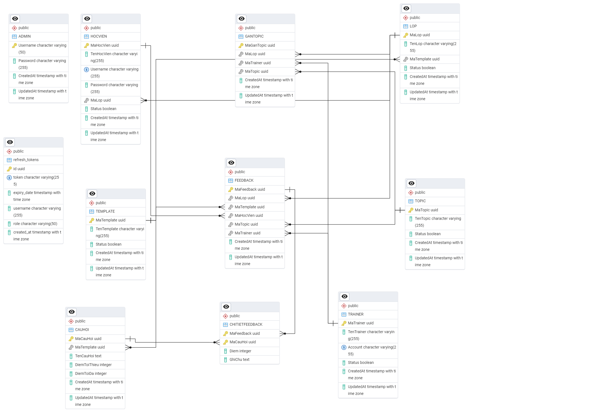

# Online Feedback Management & Analytics System
- Hệ thống quản lý và phân tích phản hồi trực tuyến toàn diện, được hiện đại hóa từ tài liệu đặc tả SRS v1.0  sang kiến trúc RESTful API sử dụng Spring Boot 3 và ReactJS.

## Mục đích dự án
Xây dựng hệ thống đánh giá chất lượng giảng viên và nội dung đào tạo tại các cơ sở giáo dục quy mô vừa và nhỏ.

- Giao diện Admin:


- Giao diện User:


##  Tech Stack
- Backend: Java 21, Spring Boot 3.x, Spring Security (JWT), Spring Data JPA, Hibernate, MapStruct, Lombok.
- Frontend: ReactJS, TailwindCSS, Recharts (Real-time Analytics Dashboard), Lucide React.
- Database: PostgreSQL 16 (Hỗ trợ tốt cho các truy vấn thống kê phức tạp).
- DevOps & Testing: Docker, Docker Compose, JUnit 5, Mockito (Coverage 80%+ tầng Service).

## Tính năng chính
Dựa trên yêu cầu nghiệp vụ từ SRS v1.0 và kiến trúc hiện đại, hệ thống bao gồm:
### 1.Xác thực & Phân quyền (RBAC):
- Sử dụng Spring Security & JWT cho xác thực không trạng thái (stateless). 
- Phân quyền người dùng: Admin quản trị và Học viên thực hiện khảo sát. 

### 2. Quản lý Khảo sát Động (Dynamic Survey):
- Thiết kế mẫu khảo sát (Template) với danh sách câu hỏi (CauHoi) không giới hạn. 
- Cơ chế ràng buộc điểm số tối thiểu/tối đa và bắt buộc nhập ghi chú dựa trên logic nghiệp vụ. 

### 3. Điều phối Feedback (Assignment):
- Tính năng Gán Topic linh hoạt: Cho phép một lớp học thực hiện feedback nhiều chủ đề khác nhau với nhiều giảng viên khác nhau. 

### 4. Dashboard & Báo cáo:
- Phân tích kết quả feedback thời gian thực thông qua biểu đồ trực quan (Recharts).
- Xuất báo cáo tổng hợp kết quả ra file Excel (Pivot data) hỗ trợ quản lý đưa ra quyết định cải thiện chất lượng. 

### 5. Quản trị Dữ liệu Hàng loạt:
- Hỗ trợ Import Học viên từ file Excel để tối ưu quy trình vận hành. 
- Tính năng Reset System bảo mật (xóa sạch data feedback nhưng giữ lại cấu hình hệ thống).

## 4. System Design & Architecture

### 4.1. High-Level Architecture (Kiến trúc tổng thể)
Mô hình kiến trúc của hệ thống được thiết kế theo hướng phân lớp (Layered Architecture), đảm bảo tính tách biệt và dễ dàng mở rộng.

- **Client Layer:** ReactJS SPA giao tiếp với Backend qua REST APIs.
- **API Gateway / Backend Layer:** Spring Boot 3 xử lý nghiệp vụ, phân quyền và xác thực bằng JWT.
- **Database Layer:** PostgreSQL (Neon) được quản lý trên Cloud và lưu trữ dữ liệu thông qua Spring Data JPA.
- **Security Layer:** Sử dụng `JwtAuthenticationFilter` và `JwtAuthenticationEntryPoint` để bảo vệ tài nguyên và chuẩn hóa lỗi trả về.

### 4.2. Luồng xác thực & Cấp lại Token (Authentication & Refresh Token Flow)
Mô hình xử lý khi Token hết hạn để duy trì phiên đăng nhập không gián đoạn:

1. **Đăng nhập (Login):** Người dùng gửi thông tin đến endpoint `/auth/login` -> Backend xác thực và trả về `accessToken` cùng `refreshToken`.
2. **Truy cập tài nguyên:** Frontend đính kèm `Authorization: Bearer <accessToken>` vào Header để gọi các API được bảo vệ.
3. **Xử lý Token hết hạn (Lỗi 401):**
   - Axios Interceptor ở Frontend bắt lỗi 401.
   - Gửi `refreshToken` lên endpoint `/auth/refresh` để lấy `accessToken` mới.
   - Lưu lại token mới vào `localStorage`, cập nhật Header và tự động gọi lại (retry) request cũ.

### 4.3. Mô hình dữ liệu (Database Design)
Tóm tắt các thực thể (Entities) chính và mối quan hệ trong cơ sở dữ liệu:

- **User / Account:** Quản lý thông tin đăng nhập, trạng thái tài khoản và phân quyền (Admin, User, Trainer).
- **Feedback:** Lưu trữ thông tin phản hồi từ người dùng và trạng thái xử lý.
- **Token Management:** Bảng `refresh_tokens` lưu trữ các phiên đăng nhập, đảm bảo tính bảo mật và quản lý phiên.

## Thiết kế Cơ sở dữ liệu (Database Schema)

Hệ thống sử dụng cơ sở dữ liệu quan hệ PostgreSQL 16 với thiết kế chuẩn hóa để đảm bảo tính toàn vẹn dữ liệu:
Các bảng chính và vai trò:
- ADMIN & HOCVIEN: Quản lý định danh người dùng và phân quyền hệ thống. 
- LOP, TRAINER, TOPIC: Các thực thể nền tảng cấu thành nên một buổi học/khóa học. 
- TEMPLATE & CAUHOI: Định nghĩa cấu trúc động cho các bài khảo sát. 
- GANTOPIC: Bảng trung gian then chốt kết nối Lớp - Giảng viên - Chủ đề. 
- FEEDBACK & CHITIETFEEDBACK: Lưu trữ kết quả khảo sát và các nhận xét chi tiết của học viên.

## Tài khoản dùng thử truy cập hệ thống
| Username   | Password | Role  |
| ---------- | -------- | ----- |
| admin      | 123456   | ADMIN |
| nguyenhieu | 123456   | USER  |

## Deployment

Dự án hiện đang được triển khai thực tế tại các nền tảng sau:

| Component | Platform | URL |
| :--- | :--- | :--- |
| **Backend API** | [Render](https://render.com/) | `https://feedbackonlinesystem.onrender.com/api/v1` |
| **Frontend Web** | [Vercel](https://vercel.com/) | `https://feedback-online-system.vercel.app` |
| **Database** | [Neon (PostgreSQL)](https://neon.tech/) | Cloud Managed |

### Production Tech Stack
* **CI/CD:** GitHub Actions tự động deploy khi có code mới trên nhánh `main`.
* **Database Cloud:** Neon với tính năng Serverless giúp tối ưu hiệu năng.
* **Environment Variables:** Toàn bộ bí mật (JWT Secret, DB Credentials) được quản lý an toàn trên Render/Vercel.
  
*** Lưu ý: nếu lần đầu sử dụng web đã deploy thì request sẽ mất khoảng 5 - 7 phút để xử lý. (vì xử dụng dịch vụ cloud free nên sẽ hơi lâu cho request đầu tiên)

## Cấu trúc tổng thể thư mục dự án
- Dự án được tổ chức theo mô hình Monorepo, giúp quản lý tập trung từ mã nguồn, cơ sở dữ liệu đến quy trình triển khai tự động.

```text
FeedbackOnlineSystem/
├── .github/workflows/     # CI/CD: Tự động hóa quy trình Test và Deploy
├── 01-backend/            # Server-side: Spring Boot 3 & Java 21
├── 02-frontend/           # Client-side: ReactJS, Vite & Tailwind CSS
├── 03-database/           # SQL Scripts: Khởi tạo và cập nhật bảng (Migration)
├── docs/                  # Documentation: Tài liệu kỹ thuật
├── .gitignore             # Khấu trừ các file rác và thông tin nhạy cảm khỏi Git
├── README.md              # Cẩm nang hướng dẫn và thông tin dự án
└── docker-compose.yml     # Containerization: Chạy nhanh dự án với Docker
```

## Backend Structure
- Mã nguồn phía máy chủ được tổ chức theo kiến trúc Layered Architecture chuẩn mực để đảm bảo tính dễ bảo trì (Maintainability) và mở rộng (Scalability).

```text
01-backend/src/main/java/com/josephhieu/feedbackonline/
├── common/                # Các thành phần dùng chung toàn hệ thống
│   ├── config/            # Cấu hình Security, CORS, Swagger, Database
│   ├── dto/               # Data Transfer Objects (Request/Response)
│   ├── exception/         # Xử lý lỗi tập trung (ErrorCode, Global Handler)
│   └── security/          # JWT, Refresh Token, Authentication EntryPoint
├── controller/            # API Endpoints (Tiếp nhận request từ Frontend)
├── entity/                # JPA Entities (Ánh xạ trực tiếp xuống Database)
├── repository/            # Tầng giao tiếp Database (Spring Data JPA)
└── service/               # Tầng xử lý nghiệp vụ chính (Business Logic)
    ├── impl/              # Các lớp triển khai (Implementation)
    └── interface/         # Các Interface định nghĩa phương thức
```

## Frontend Structure
- Phía Client được xây dựng với tư duy tách biệt giữa Giao diện (UI) và Logic xử lý dữ liệu (Services).

```text
02-frontend/src/
├── assets/                # Tài nguyên tĩnh: Hình ảnh, Stylesheets, Icons
├── components/            # Các thành phần giao diện có thể tái sử dụng
├── hooks/                 # Custom React Hooks (useAuth, useFetch...)
├── pages/                 # Các trang giao diện chính (Login, Dashboard...)
├── services/              # Tầng giao tiếp API (Axios Interceptors, authService.js)
├── routes/                # Quản lý định tuyến (Public/Protected Routes)
└── context/               # Quản lý trạng thái toàn cục (AuthContext)
```
